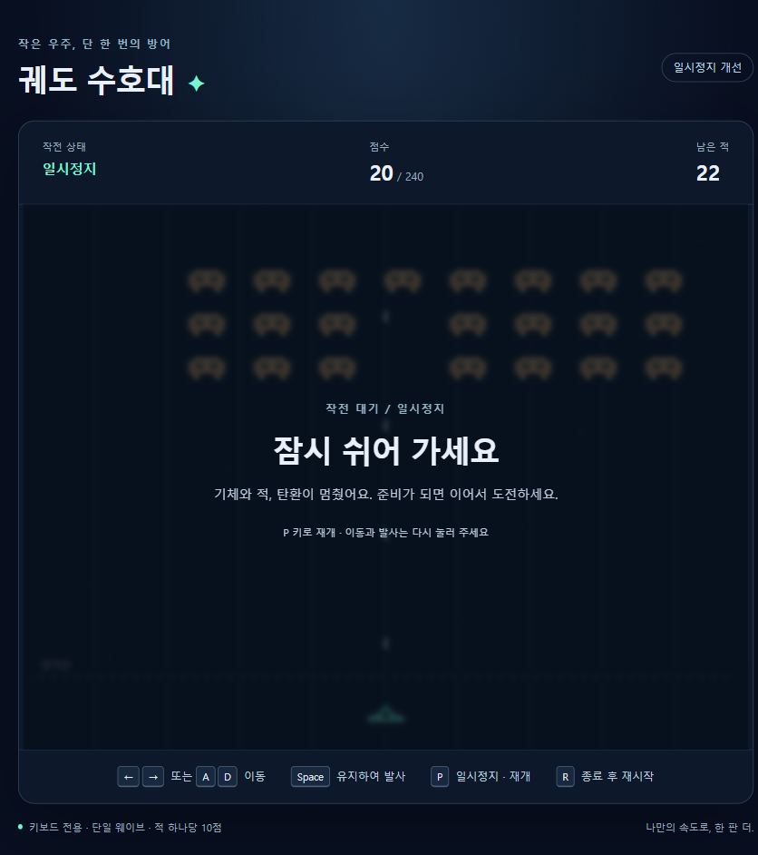

# Copilot App으로 만드는 우주 방어

빈 Public 저장소에서 **문서 → 이슈 → 구현 → 검증 → PR·Pages → 개선**을 경험하는 한국어 실습입니다.
GitHub Copilot **App**에서 계획을 검토하고 실행·공개를 승인하며 Space Invaders 스타일의 **우주 방어**를 만듭니다.
CLI·VS Code 사용법이나 전문 게임 엔진 설계가 아닌, 초보자를 위한 짧은 개발 사이클입니다.

## 현재 상태: v2 안내서 작성, 새 리허설 대기

**전체 안내 1개 + 실습 20개 = 문서 21개**입니다.
기본 과정 01~07은 16개, 선택 과정 08~09는 4개입니다.
이번 개편의 실행 검증과 이전 실습의 성공을 구분합니다.

| 자료 | 확인 상태 |
|---|---|
| [v2 전체 안내와 20개 목차](docs/00-전체-실습-안내.md) | 작성 완료, demo02 리허설 **대기 중** |
| [개발 문서와 작업 규칙](docs/01-02-개발-문서와-작업-규칙.md) | 역할 설계 후 최소 AGENTS 생성 |
| [App 설정](docs/04-03-App-설정과-README.md)·[game-check Skill](docs/05-01-게임-검증과-Skill.md) | 필수 `.github` 커스터마이징 두 개, App 실제 동작은 새 리허설 대상 |
| [역사적 최초 샘플](src/game-samples/first-release/README.md) | Node 35·Chromium 10, 빌드·하위 경로 검사 통과 |
| [역사적 일시정지 샘플](src/game-samples/improved-release/README.md) | Node 42·Chromium 13, 빌드·하위 경로·정지/재개 검사 통과 |
| [이전 demo01 공개 게임](https://hahaysh.github.io/space-Invaders-demo01/) | 이전 **25개** 실습 리허설 완료, 난이도·목숨 포함 |
| 사람의 App·PR UI, AGENTS 자동 로딩 | 미검증; API 실행·명시적 읽기로 대체 입증하지 않음 |

demo01의 최종 main은 `97cd3e1fca2face6bf84c034412ae31a60fa6056`이며,
[Actions 34793874053](https://github.com/hahaysh/space-Invaders-demo01/actions/runs/34793874053)에서
Node 33·Chromium 28·빌드·배포가 성공했습니다.
자율 API 실행과 직접 fast-forward 병합 예외를 사용했으므로 사람의 전체 App 경로 검증은 아닙니다.
긴 테스트 정지의 호스트 원인은 미확정이며, 철회한 외부 스크립트 의심은 실제 버그가 아니었습니다.
demo01과 두 샘플의 코드·제목은 이번 문서 개편에서 바꾸지 않습니다.

## 참고 화면

[샘플 안내](src/game-samples/README.md)에서 두 역사적 버전의 실행 방법과 확인 범위를 볼 수 있습니다.

## 두 저장소의 역할

- **이 저장소:** 실습 안내서와 참고 샘플을 읽는 곳입니다.
- **참가자 저장소:** 참가자가 GitHub에 새 Public 저장소를 만들고 Copilot app에 프로젝트로 추가해 작업하는 곳입니다.

안내 저장소를 복제하거나 샘플을 복사해서 시작하지 않습니다.
`AGENTS.md`, `ideation.md`, `PRD.md`, `TRD.md`, 계획·검증 문서와 게임 코드는 참가자 저장소에서 생성합니다.
이 안내 저장소 자체를 게임 사이트로 배포하지 않습니다.

## 학습 흐름

| 단계 | 목적 |
|---|---|
| 1. 준비 (2개) | 빈 Public 저장소·문서 역할 설계·최소 작업 규칙 |
| 2. 게임 설계 (3개) | 아이디어·PRD·TRD |
| 3. 점검 (1개) | **문서 PR을 먼저 main에 병합**, 기본 게임 이슈·새 세션 |
| 4. 구현 (3개) | 한 이슈의 M1/M2/M3, App 설정·README, 기본 게임 PR 병합 |
| 5. 검증 (2개) | 최신 main의 검증·배포 이슈, Skill·실제 검사·필요한 결함 수정 |
| 6. 배포 (3개) | Pages 준비·workflow·PR·실제 공개 URL 확인 |
| 7. 개선 (2개) | 새 이슈·기능 세션에서 P 일시정지·회귀·재배포 |
| 8. 선택 확장 (2개) | 새 이슈·기능 세션에서 난이도 선택·재배포 |
| 9. 선택 확장 (2개) | 새 이슈·기능 세션에서 목숨·재도전·재배포 |

각 실습은 **설명 → 시작 상태 → Plan → 승인·Interactive → 눈으로 확인 → 완료** 순서입니다.
보완은 실패했을 때만 합니다. 원격 제출·PR 병합·공개에는 필요한 사람 승인 경계를 둡니다.
M1마다 이슈를 새로 만들지 않으며, 개선은 각각 직전 변경이 병합된 최신 main에서 시작합니다.
Pages workflow 외 `.github` 실습은 수동 App 설정과 game-check Skill 두 개뿐입니다.
실행 결과와 공개 증거는 구분하고, 이슈 댓글로 기록한 뒤 기록용 PR을 무한 반복하지 않습니다.

## 자료 위치

- `docs`: 한국어 파일명의 전체 안내 1개·기본 실습 16개·선택 실습 4개입니다.
- `src/game-samples`: 최초·일시정지 버전 참고 샘플이며 v2 정답 코드가 아닙니다.
- [참고 자료와 사용 원칙](REFERENCES.md): 원본 분석, 새로 설계한 내용, 출처와 확인 범위를 기록합니다.

이 실습은 Microsoft의 [Build26 LAB502](https://github.com/microsoft/Build26-LAB502-make-github-copilot-work-your-way-custom-tools-context-and-workflows)를 참고해 새로 구성한 독립적인 학습 자료입니다. Microsoft의 공식 실습이나 지원 자료로 표시하지 않습니다.

## 변경 이력

변경 이유·검증·미확인을 한국어 커밋에 남깁니다. 기존 영어 Initial commit과 체크포인트는 보존합니다.
이전 고정 안내서 [`c545b103`](https://github.com/hahaysh/space-Invaders/tree/c545b103/docs)는 역사적 자료이며 v2의 현재 기준이 아닙니다.
현재 안내서는 위 한국어 파일 목차를 사용합니다. 출처·라이선스와 상세 검증 경계는 [REFERENCES](REFERENCES.md)에 있습니다.
