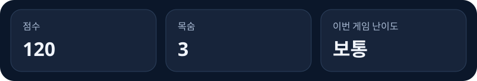

# 화면과 에셋 기준

[전체 실습](00-전체-실습-안내.md) · [아이디어](02-01-게임-아이디어.md) · [요구사항](02-02-요구사항-작성.md) · [출처](../REFERENCES.md)

20개 실습에서 함께 참조하는 **디자인·파일 사양**이며 별도의 추가 실습이 아닙니다.
게임 코드나 샘플을 복사하지 않고, 아래 CC0 이미지 두 개만 참가자 저장소에 내려받습니다.
모바일 조작·터치 입력·모바일 검증, 적 탄환은 범위 밖입니다.

## 상단 상태바

**09까지 완료했을 때의 구성 예시**이며 실제 게임 실행 캡처가 아닙니다.
최고 점수·웨이브 기능은 추가하지 않습니다.

| 구분 | 화면 기준 |
|---|---|
| 공통 모양 | 짙은 남색 둥근 패널, 조금 밝은 카드 배경, 은은한 테두리 |
| 정보 위계 | 위쪽에 작고 차분한 라벨, 아래에 크고 굵은 밝은 값 |
| 정렬 | 같은 너비·높이·안쪽 여백, 일정한 간격; 값이 바뀌어도 카드가 밀리지 않음 |
| 단계별 카드 | 04는 **점수**만, 08은 **점수 / 이번 게임 난이도**, 09는 **점수 / 목숨 / 이번 게임 난이도** |
| 조작 분리 | 상태 안내·시작/재시작 버튼은 카드 밖; 08부터 난이도 select도 별도 설정 행 |
| 값의 의미 | 난이도 카드는 current, '다음 게임 난이도' select는 pending; title의 current는 초기 보통 |

HTML/CSS로 만들고 라벨·값을 실제 텍스트로 제공합니다. 정보를 Canvas 안에만 그리지 않습니다.
숫자는 같은 폭으로 표시하고 `0→240`, `3→0`, `쉬움/보통/어려움`에서 정렬·가독성을 확인합니다.
PC 브라우저 창을 줄여도 잘림·겹침이 없어야 하지만 모바일 플레이를 지원한다는 뜻은 아닙니다.
미구현 목숨·난이도의 빈 카드나 가짜 값을 첫 버전에 미리 넣지 않습니다.

## 고정 비행체 이미지

**Kenney의 Space Shooter (Redux)** PNG를 사용합니다. 몸체·날개·조종석이 있는 같은 스타일의 기체입니다.
제작자는 [Kenney](https://kenney.nl/), 아래 배포처는 **공식 배포처가 아닌 제3자 미러**입니다.
미러의 포함 라이선스가 이 팩과 제작자를 명시하며 [Kenney 공식 사용 안내](https://kenney.nl/support)와 함께 확인했습니다.
현재 접근 가능한 공식 팩 전용 페이지는 확인하지 못했으므로 추정 링크를 사용하지 않습니다.

- 미러: [mhmd-azeez/extism-space-commander](https://github.com/mhmd-azeez/extism-space-commander/tree/b5ea6c01d219da1d2fc73c088dc86e3ab9e961c2/assets)
- 고정 커밋: `b5ea6c01d219da1d2fc73c088dc86e3ab9e961c2` — main/latest 주소로 바꾸지 않습니다.
- 라이선스: **CC0 1.0**. 개인·상업적 이용과 재배포가 가능하며 출처 표시는 의무가 아니지만 실습에서는 남깁니다.
- 원본 PNG는 수정하지 않습니다. 전체 미러·다른 게임 코드·폰트·소리·이미지 묶음은 가져오지 않습니다.

| 사용 시점 / 역할 | 원본 다운로드 | 참가자 저장소 경로 | 원본 크기 / 바이트 |
|---|---|---|---|
| M1 / 청색 플레이어 | [playerShip1_blue.png](https://raw.githubusercontent.com/mhmd-azeez/extism-space-commander/b5ea6c01d219da1d2fc73c088dc86e3ab9e961c2/assets/PNG/playerShip1_blue.png) | `src/assets/ships/playerShip1_blue.png` | 99×75 / 2698 |
| M2 / 적갈색 적 | [enemyRed1.png](https://raw.githubusercontent.com/mhmd-azeez/extism-space-commander/b5ea6c01d219da1d2fc73c088dc86e3ab9e961c2/assets/PNG/Enemies/enemyRed1.png) | `src/assets/ships/enemyRed1.png` | 93×84 / 3096 |
| M1 / 포함 라이선스 | [license.txt](https://raw.githubusercontent.com/mhmd-azeez/extism-space-commander/b5ea6c01d219da1d2fc73c088dc86e3ab9e961c2/assets/license.txt) | `src/assets/ships/LICENSE-Kenney.txt` | 498 |

다운로드 후 아래 **SHA-256**과 대조합니다. 응답 실패·해시 불일치는 기록하고 중단하며 임의 이미지로 바꾸지 않습니다.

| 파일 | SHA-256 |
|---|---|
| playerShip1_blue.png | `648ec1635979fb867d08bfd0c56f011d6559dd953a13c73109c6186a3069f7ee` |
| enemyRed1.png | `83bbe7b408f080c128de595ddeb5996aaa5432dc28d800eb5d0e07990b525e74` |
| LICENSE-Kenney.txt | `c8cf4591af39c24e65560fbfcc271de9d97b135e0316f963485b9e770455b6db` |

## 그림과 게임 규칙의 경계

기존 Canvas 2D의 `drawImage`를 사용하며 그림을 위해 Phaser/Pixi 같은 엔진을 추가하지 않습니다.
**모델·충돌 크기와 좌표는 PRD 그대로**입니다. 이미지의 투명 영역이나 외곽 픽셀로 충돌을 다시 정의하지 않습니다.
그림은 너비 40에 원본 비율을 유지합니다. 찌그러뜨리거나 단순 삼각형·사각형으로 대체하지 않습니다.

| 대상 | 모델 영역 | 그림 영역(높이는 근삿값) | 그림 배치 |
|---|---|---|---|
| 플레이어 | 40×20 | 40×30.30 | 모델 왼쪽·위쪽에 맞춤; 탄환 출발점 유지 |
| 적 | 40×24 | 40×36.13 | 모델 왼쪽·아래쪽에 맞춤; 그림 바닥과 방어선 판정 일치 |

높이는 `40 × 원본 높이 / 원본 너비`로 계산합니다. 그림 일부와 투명 영역은 모델 사각형과 다릅니다.
이는 외형 표현만의 변경이며 픽셀 단위 피격 판정을 도입하지 않습니다. 이동 경계·적 간격·충돌 규칙은 유지합니다.
실제 게임 크기에서 위를 향한 플레이어와 아래를 향한 적, 날개·몸체·조종석, 배경 대비를 눈으로 확인합니다.

## 로딩·배포·기록

02에서는 출처와 사양만 문서화하고 다운로드·구현은 M1/M2에서 합니다.
이미지는 참가자 저장소에서 정적 import하고 Vite가 만든 URL로 로드합니다. 런타임 외부 URL/CDN은 사용하지 않습니다.
해당 단계에서 쓰는 이미지가 모두 로드된 뒤에만 시작을 허용하고, 실패하면 명시적 오류와 시작 불가 상태를 표시합니다.
Vite는 작은 PNG를 빌드 JS의 data URL로 넣을 수도 있습니다. 별도 PNG 파일이 없다는 이유만으로 누락으로 판정하지 않습니다.
root·저장소 하위 경로·공개 URL에서 실제 디코딩과 표시를 확인하고, 파일 URL이면 응답·MIME·404도 확인합니다.
README에 제작자·팩·고정 출처·사용 파일·CC0·보존한 라이선스 경로를 짧게 남깁니다.

이 사양은 demo02 완료 후 추가됐습니다. 에셋 파일·해시·포함 라이선스와 정적 카드/기체 미리보기는 확인했지만,
**이 사양을 적용한 게임의 전체 실습·공개 배포 리허설은 아직 하지 않았습니다.** 기존 demo02나 샘플을 그 근거로 제시하지 않습니다.
