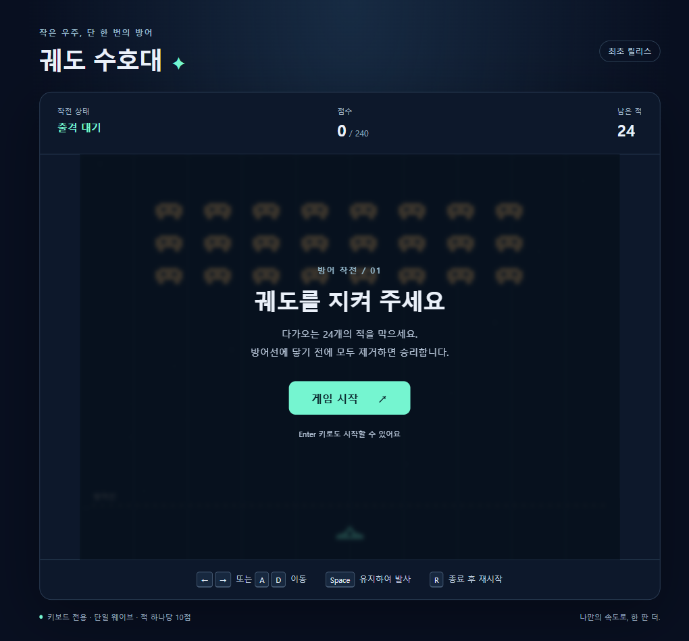
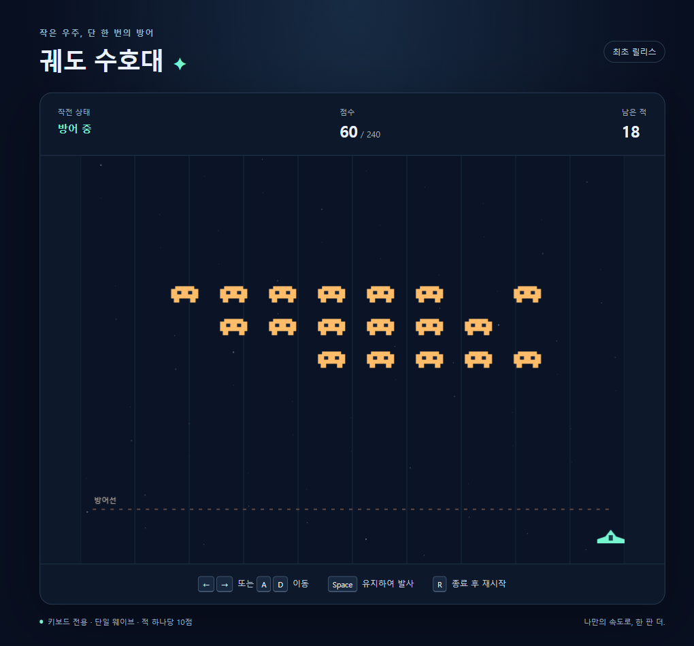

# Space Invaders 참고 샘플

[실습 전체 목차](../../docs/00-overview.md) · [출처와 확인 범위](../../REFERENCES.md)

이 폴더에는 실습의 공통 경로를 따라 생성한 **최초 버전과 개선 버전**을 독립적으로 실행할 수 있는 프로젝트로 보관합니다. 샘플을 복사해서 시작하는 것은 기본 실습 경로가 아닙니다.

> 두 버전 모두 구현·로컬 자동 검증을 마쳤습니다. 실제 Copilot app 시작 UI와 원격 배포는 아직 미확인입니다.

## 두 체크포인트

| 경로 | 대응 단계 | 포함할 결과 |
|---|---|---|
| [first-release](first-release/README.md) | 01~06 | 최초 문서, 게임, 테스트, Pages 워크플로. 체크포인트 `0162756` |
| [improved-release](improved-release/README.md) | 07 | 일시정지·재개 변경 요청, 수정된 문서·코드·테스트. 기존 워크플로 유지. 체크포인트 `ede4854` |

`release`라는 폴더명은 실습상의 버전 구분이며, GitHub Release를 생성하거나 실제 인터넷 배포를 마쳤다는 의미가 아닙니다. 원격 배포 여부는 각 프로젝트의 `TEST_RESULTS.md`로 확인합니다.

## 실제 화면과 확인 결과






위 이미지는 첫 샘플의 실제 Vite 빌드 결과를 loopback preview 서버에서 열어 생성했습니다. 원본 저장소 이미지가 아닙니다.

- 최초 샘플의 Node 테스트 35개, Chromium E2E 10개, 빌드와 하위 경로 검사가 통과했습니다.
- 개선 샘플의 Node 테스트 42개, Chromium E2E 13개, 빌드와 개선 하위 경로·정지/재개 검사가 통과했습니다. 최초 35개 Node 검사 본문은 변경하지 않았습니다.
- 별도의 브라우저 도구로 시작 버튼·이동·발사를 실행해 `playing`, 60점, 남은 적 18개를 확인했고 Console 오류는 0개였습니다.
- 개선 빌드도 별도 브라우저에서 20점까지 발사한 뒤 P로 정지해 2초 동안 Canvas 데이터가 같은 것을 확인하고, P 재개 후 화면 갱신을 확인했습니다.
- 이는 자동 브라우저 조작이며 사람의 직접 플레이 또는 실제 OS 창 전환 확인을 대신하지 않습니다.
- 상세 실행·실패·수정 이력은 [최초 버전 검증 기록](first-release/TEST_RESULTS.md)과 [개선 버전 검증 기록](improved-release/TEST_RESULTS.md)에 있습니다.

## 실행 방법

Node.js 24 LTS 환경에서 한 번에 한 샘플을 선택합니다. 아래 PowerShell 명령은 **이 실습 안내 저장소의 루트**에서 실행하는 예입니다. Copilot app에서 에이전트에게 해당 경로를 지정해 실행을 요청해도 됩니다.

```powershell
Set-Location .\src\game-samples\first-release
npm ci
npx playwright install chromium
npm test
npm run test:e2e
npm run build
node scripts\check-build.mjs
npm run dev -- --host 127.0.0.1
```

개선 버전은 첫 줄의 경로를 `.\src\game-samples\improved-release`로 바꿉니다. 서버가 출력하는 실제 URL을 열고, 사용 후 해당 서버만 종료합니다.

의존성은 프로젝트별로 설치합니다. 샘플의 `node_modules`, `dist`, Playwright 결과 파일은 저장소에 커밋하지 않습니다.

## 비교하면서 읽기

1. 각 버전의 `PRD.md`에서 REQ-01~08을 읽습니다.
2. `TRD.md`에서 요구사항을 어떤 구조로 구현했는지 확인합니다.
3. `IMPLEMENTATION_PLAN.md`와 `TEST_PLAN.md`에서 작업과 테스트의 연결을 확인합니다.
4. `TEST_RESULTS.md`에서 실제 수행 결과와 미확인 항목을 구분합니다.
5. 개선 버전의 `CHANGE_REQUEST.md`와 CHG-01을 읽고 수정된 부분을 비교합니다.

소스 비교 예시입니다. 차이가 있으면 `git diff --no-index`는 종료 코드 1을 반환하며, 이는 테스트 실패라는 뜻이 아닙니다.

```powershell
git diff --no-index -- .\src\game-samples\first-release\src\game.js .\src\game-samples\improved-release\src\game.js
```

기능 변경이 없던 문서는 억지로 수정하지 않습니다. 예를 들어 일시정지를 추가해도 게임 콘셉트나 에이전트 작업 규칙이 그대로라면 해당 문서는 동일할 수 있습니다.

이번 샘플은 `ideation.md`, 패키지·잠금 파일, 스타일, Vite·Playwright 설정, Pages 워크플로를 유지했습니다. `AGENTS.md`는 최초 작업에만 한정한 범위 문장을 개선 작업에 맞게 조정했습니다. 제품 요구사항을 새 작업에 맞추는 것과 에이전트의 작업 범위를 수정하는 것을 구분해 비교할 수 있습니다.

개선판의 패키지 이름·버전은 최초 manifest를 그대로 유지했습니다. 실행 폴더와 화면 제목으로 버전을 구분하며, npm 패키지 게시나 실제 GitHub Release 발행은 이 실습 범위가 아닙니다.

## 배포 설정의 위치

각 샘플의 `.github\workflows\pages.yml`은 **그 샘플을 독립적인 저장소 루트에서 사용할 경우**의 배포 설정입니다. 이 폴더 안에 있는 상태로는 현재 안내 저장소의 Actions 워크플로로 자동 실행되지 않습니다.

실습 참가자는 자신의 저장소 루트에서 문서·코드·워크플로를 생성합니다. 배포 전에 GitHub Pages 소스를 GitHub Actions로 선택하고, 브랜치·권한·공개 범위를 확인해야 합니다. 배포 아티팩트는 `dist`만 사용합니다.

## 참고 결과이지 정답이 아닙니다

에이전트 출력은 달라질 수 있습니다. 함수 이름이나 문서 표현보다 다음을 기준으로 점검합니다.

- 요구사항과 실제 동작이 일치하는가?
- 최초 버전에 개선 기능을 미리 구현하지 않았는가?
- 개선 후에도 기존 테스트와 게임 규칙을 유지하는가?
- 테스트 통과를 실제 app 조작 또는 공개 배포 성공으로 바꾸어 말하지 않는가?

샘플은 원본 게임 파일을 복사하지 않고 새로 구현합니다. 개발 문서 작성 후 코드·테스트를 생성하는 자동 산출물 리허설로 만들었으며, 참가자별 승인·중간 커밋을 그대로 재현했다고 주장하지 않습니다.

최초 리허설에서는 검증 조건을 고정하기 위해 테스트 계획을 구현 전에 작성했습니다. 기본 안내서는 05단계에서 테스트 계획을 파일로 정리하므로 작성 시점에 차이가 있습니다. 이 차이와 실제 수행 범위는 각 검증 기록에 남겨 두었습니다.
